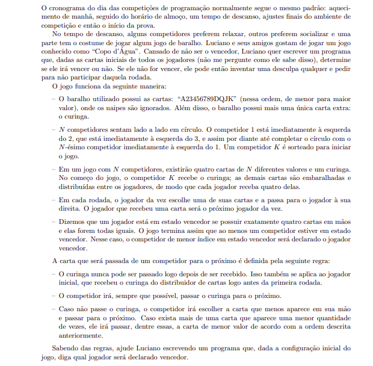

# SBC-XXIV-maratona-de-programacao
Soluções dos problemas da XXIV Maratona de Programação organizada pela SBC

# Problema A: Arte Valiosa

# Problema B: Bobo da Corte

# Problema C: Cruzamento Perigoso

# Problema D: Delação Premiada

# Problema E: Exibição de Peixes

# Problema F: Florestas em Risco

# Problema G: Guardando Enfeites

# Problema H: Hora da Corrida

# Problema I: Interplanetário

# Problema J: Jogo de Baralho

# Problema K: Keep Calm e Venda Balões

# Problema L: Lançando Moedas

# Problema M: Maratona Brasileira de Comedores de pipocas

